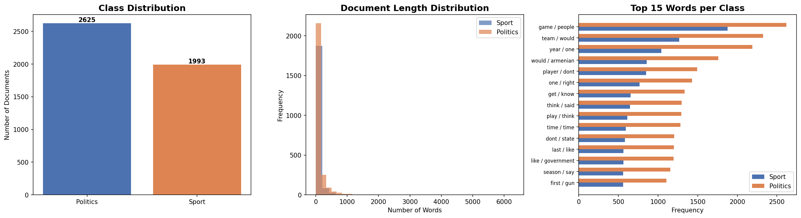
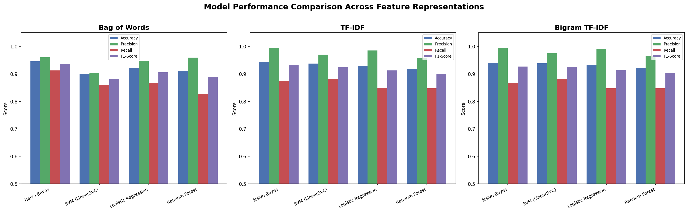
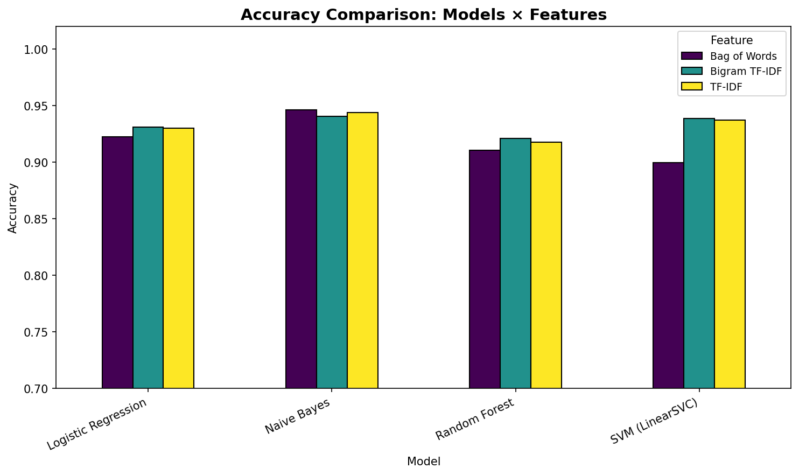

# 🏟️ Sport vs Politics Text Classifier

A machine learning pipeline that classifies text documents as **Sport** or **Politics** using the 20 Newsgroups dataset. This project compares four ML algorithms across three feature representations, totaling 12 experimental configurations.

## 📊 Quick Results

| Rank | Model | Feature | Accuracy | F1-Score |
|------|-------|---------|----------|----------|
| 🥇 | Naive Bayes | Bag of Words | **94.59%** | **93.57%** |
| 🥈 | Naive Bayes | TF-IDF | 94.37% | 93.07% |
| 🥉 | Naive Bayes | Bigram TF-IDF | 94.05% | 92.64% |
| 4 | SVM (LinearSVC) | Bigram TF-IDF | 93.83% | 92.49% |

> **Best Configuration:** Multinomial Naive Bayes + Bag of Words achieves **94.59% accuracy**

## 🔬 Approach

### Dataset
- **Source:** [20 Newsgroups](http://qwone.com/~jason/20Newsgroups/) via scikit-learn
- **Sport:** `rec.sport.baseball`, `rec.sport.hockey` (1,197 docs)
- **Politics:** `talk.politics.misc`, `talk.politics.guns`, `talk.politics.mideast` (1,780 docs)
- **Total:** 2,977 documents | 80/20 train-test split

### Feature Representations
| Method | Description | Max Features |
|--------|-------------|-------------|
| **Bag of Words** | Word count vectors | 10,000 |
| **TF-IDF** | Term frequency weighted by inverse document frequency | 10,000 |
| **Bigram TF-IDF** | Unigram + bigram TF-IDF vectors | 15,000 |

### ML Models
1. **Multinomial Naive Bayes** — Probabilistic classifier with Laplace smoothing
2. **SVM (LinearSVC)** — Linear margin-maximizing classifier
3. **Logistic Regression** — Probabilistic linear classifier with L2 regularization
4. **Random Forest** — Ensemble of 200 decision trees

### Preprocessing Pipeline
Lowercasing → Special character removal → Tokenization → Stopword removal → Lemmatization → Short word filtering

## 📈 Visualizations

### Dataset Analysis


### Model Comparison


### Accuracy Across Configurations


## 🚀 How to Run

```bash
# Install dependencies
pip install -r requirements.txt

# Run the full pipeline
python m25cse013_prob4.py
```

The script will:
1. Download the 20 Newsgroups dataset automatically
2. Preprocess all documents (lowercasing, lemmatization, stopword removal)
3. Extract features (BoW, TF-IDF, Bigram TF-IDF)
4. Train & evaluate 4 models × 3 features = 12 configurations
5. Save results to `results.csv` and plots to `plots/`

## 📁 Project Structure

```
├── a4-1.py              # Main classification script
├── requirements.txt     # Python dependencies
├── REPORT.md            # Detailed report (5+ pages)
├── README.md            # This file
├── results.csv          # Results table (CSV)
└── plots/               # All generated visualizations
    ├── dataset_analysis.png
    ├── model_comparison.png
    ├── accuracy_comparison.png
    └── cm_*.png          # Confusion matrices (12 files)
```

## 📝 Detailed Report

See [REPORT.md](REPORT.md) for the full analysis including:
- Data collection methodology
- Dataset description & exploratory analysis
- Feature representation techniques (mathematical formulations)
- ML algorithm descriptions
- Quantitative comparison across all 12 configurations
- Discussion of results
- System limitations & future work

## 🛠️ Requirements

- Python 3.7+
- scikit-learn
- nltk
- numpy
- pandas
- matplotlib
- seaborn

## 📌 Key Findings

1. **Naive Bayes dominates** — Best accuracy with all three feature types
2. **Linear models > ensemble** — SVM, LR outperform Random Forest on sparse text data
3. **BoW is sufficient** — Simple word counts work as well as TF-IDF for this task
4. **High precision, lower recall** — All models are conservative in predicting Sport (minority class)

## 👤 Author

**Gaurav Singh Baghel** — NLU Assignment 4, February 2026
